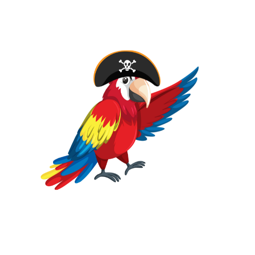

# Captain Hooks  :  Hooks that enable better TradFi Adoption

## TL;DR: 

Captain Hooks is a Uniswapv4 tool for banks and institutions, offering custom pools with dynamic fee options. It promotes traditional finance inclusion, facilitating various use cases like stock trading and asset tokenization with simplified asset management.

## How's made

Composed of 4 core smart contracts : 

1. **Router04** : 

- Interacts with the PoolManager. 
- Allows executions of operations such as AddLiquidity, RemoveLiquidity and Swap. 

2. **Pool Manager** : (specific to uniswap v4-core)

- Allows to create Pools (storage variables) 
- When you create these pools you pass the hooks address. 

3. **Universal Hook Factory** : 

- Allows deploying instances of Universal Hook. 
- Creation of unique Universal Hook with specific salts. 

4. **Universal Hook** : 

- Managing hooks and fees 
- Each Universal Hook is associated with a distinct salt

IMPORTANT : Contracts deployed on side chains will have similar ABIs for seemless integration in the FE.

## Technologies Used

### Uniswap 

Uniswap offers seamless integrations for hooks in UniswapV4. This enables us to create custom pools. We have used it [here](). 

### Polygon 

### Coinbase 

### Arbitrum 

### Celo 

### Mantle 

### Linea 

### Gnosis 

## Deployed Contracts

### Goerli : 

- [PoolManager]()
- [UniversalHookFactory]()
- [UniversalHook]()

### Base Goerli :

- [PoolManager]()
- [UniversalHookFactory]()
- [UniversalHook]()

### Mumbai :
  
- [PoolManager]()
- [UniversalHookFactory]()
- [UniversalHook]()

### Arbitrum Goerli :

- [PoolManager]()
- [UniversalHookFactory]()
- [UniversalHook]()

### Celo Alfajores Testnet : 

- [PoolManager]()
- [UniversalHookFactory]()
- [UniversalHook]()

### Gnosis Chiado : 

- [PoolManager]()
- [UniversalHookFactory]()
- [UniversalHook]()

### Scroll Sepolia : 

- [PoolManager]()
- [UniversalHookFactory]()
- [UniversalHook]()

### Mantle Testnet : 

- [PoolManager]()
- [UniversalHookFactory]()
- [UniversalHook]()

### Linea Goerli : 

- [PoolManager]()
- [UniversalHookFactory]()
- [UniversalHook]()

## DEMO 

## PoC Live 

## DeployScripts 

